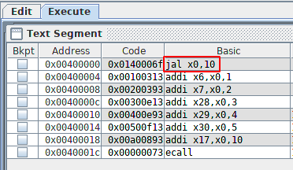

# Parcial 2 del LAB. TEST
* Temario: L5,L6,L7,L8

**Nota**: La respuesta correcta siempre es la primera


### 1) L5: Llamadas al sistema

Analiza el siguiente programa:

```
	.text
	
	li a0, 65
	li a7, 34
	ecall
	
	
	li a7, 10
	ecall
```

1. Imprime el numero 65 en hexadecimal en la consola
2. Imprime en la consola el contenido de la dirección 65
3. Se solicita el servicio 65 del sistema operativo
4. Se hace una llamada al sistema, pero es incorrecta

### 2) L5: Registros ABI

Este fragmento de código:

```asm
	sub t3, t0, t1  
	addi t4, t2, 5
	add t6, t3, t4
```	
	
1. Calcula la expresión t6 = (t0 - t1) + (t2 + 5)
2. Calcula la expresión t6 = t3 - t4 + t2 + 5 -t1 + t0
3. Se usan los registros de manera incorrecta
4. Calcula la expresión t6 = t6 + t3 + t4

### 3) L6: Acceso a bytes

Analiza el programa y responde:

	.data
a:	.word 0xCAFEBACA
	
	.text
	
	la t0, a
	lb t1, 1(t0)
	sb t1, 0(t0)
	
	li a7, 10
	ecall 
	
1. Este programa escribe en el byte de menor peso de la variable a el valor 0xBA
2. No modifica la variable a, ya que es una palabra
3. Provoca un error de alineamiento
4. Este programa no ensambla correctamente


### 4) L6: Cadenas

El siguiente programa imprime una cadena cifrada. ¿Qué valor hay que darle a K para que imprima la cadena descifrada?

	.eqv PRINT_STRING 4
	.eqv EXIT 10
	
	 #-- Clave para descifrar
	.eqv K 0
	.data
	
	#-- Mensaje cifrado
msg:	.string "Ipmb\n"

	.text
	
	la a0, msg
	
	#-- Descifrar
	lb t0, 0(a0)
	addi t0, t0, K
	sb t0, 0(a0)
	
	lb t0, 1(a0)
	addi t0, t0, K
	sb t0, 1(a0)
	
	lb t0, 2(a0)
	addi t0, t0, K
	sb t0, 2(a0)
	
	lb t0, 3(a0)
	addi t0, t0, K
	sb t0, 3(a0)
	
	#-- Imprimir el mensaje descifrado
	li a7, PRINT_STRING
	ecall

	#-- Terminar
	li a7, EXIT
	ecall 


1.  -1
2.  1
3.  2
4.  Este programa no modifca la cadena original


### 5) L7: Instrucción b

Tras la ejecución de la instrucción situada en la dirección 0x00400000, ¿Cuál es la siguiente instrucción que se ejecutará? (Los números que hay en la columna Basic están en el sistema DECIMAL)



a) `addi x30,x0,5`
b) La instrucción de la dirección 0x00400000 + 10
c) `addi x17,x0,10`
d) La siguiente instrucción a jal x0,10

### 6) L7: Intrucción jal

En la dirección 0x00400010 se encuentra la instrucción `jal x0, 0xFFFFFFFE`. ¿En qué dirección se encuentra la siguiente instrucción que se ejecutará tras esta?

a)  0x0040000C
b)  0x00400008
c)  0xFFFFFFFE
d)  0x004000FE

### 7) L7: Salto condicional
  Dado este fragmento de programa. Tras la ejecución de la instrucción de la  línea 4, ¿La instrucción de qué linea se ejecuta a continuación?

```asm
                      #-- Linea 1
      li t0, 1        #-- Linea 2
      li t1, 1        #-- Linea 3
      blt t0,t1, hola #-- Linea 4
      li t2, 2        #-- Linea 5
hola:                 #-- Linea 6
      li t3, 3        #-- Linea 7      
```

a) Línea 5
b) Línea 4
c) Línea 6
d) Línea 7

### 8) L8: Caracteres ASCII

Dado el siguiente fragmento de programa. Tras su ejecución, ¿qué caracter habrá almacenado en t0?

```
 li t0, 'A'
 addi t0, t0, 1
```

a) 'B'
b) No se puede sumar un numero a un carácter
c) Se produce un error en tiempo de ejecución
d) '1'

### 9) L8: Cadenas

¿Qué hace el siguiente programa?

```
	 .data
ca:      .string "CADENA"
cb: 

	.text
	
	la a0, ca
	la t0, cb

bucle:			
	lb t1, 0(a0)
	sb t1, 0(t0)
	beq t1,zero, fin

	addi a0, a0, 1
	addi t0, t0, 1

	b bucle
fin:
	
	li a7, 10
	ecall
```

a) Copia la cadena situada en la dirección 0x10010000 en la dirección 0x10010007  
b) Mueve la cadena "CADENA" 10 bytes más arriba de su posición inicial  
c) Borra la cadena de la memoria  
d) Calcula la longitud de la cadena "CADENA"  


### 10) L8: Acceso a Cadenas

Si a0 contiene la dirección de la cadena "123456789", ¿Qué ocurre al ejecutar este fragmento de código?

```
	addi a0, a0, 3
	li a1, 'A'
	sb a1, 1(a0)
```

a) Escribe el carácter 'A' sobre el '5'
b) Escribe el carácter 'A' sobre el '4'
c) Escribe el carácter 'A' sobre el '3'
d) Se provoca un error de alineamiento

