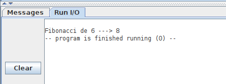

# PARCIAL 3. Programación


## Programa 1

El siguiente programa calcula el término de fibonacci indicado en la constante N, y lo imprime en la consola

```
#---------------------------
#-- Sucesion de Fibonacci
#-- Calcular el término n
#---------------------------
#-- fib(0) = 0
#-- fib(1) = 1
#-- fib(2) = 1
#-- fib(3) = 2
#-- fib(4) = 3
#-- fib(5) = 5
#-- fib(6) = 8
#-- fib(n) = fib(n-1) + fib(n-2)

	#-- Servicios del sistema operativo
  	.eqv PRINT_INT    1
	.eqv PRINT_STRING 4
	.eqv EXIT         10
	
	#-- Termino de fibonacci a Calcular: fib(N)
	#-- (Debe ser > 1)
	.eqv N 6

	.data
msg1: .string "\nFibonacci de "
msg2: .string " ---> "

	.text
	
	#-- Meter en t6 el termino a calcular
	li t6, N  
	
	#-- El registro t5 se usa para indicar el numero del termino 
	#-- de fibonacci actual (n)
	li t5, 1  #-- Termino final a calcular
	
	
	#-- Los registros t0 y t1 contienen fib(n) y fib(n+1)
	li t0, 0
	li t1, 1

bucle:		
	#-- Comprobar si hemos calculado el termino pedido
	beq t5,t6, fin
	
	#-- Calcular el siguiente termino: t2 = t1 + t0
	add t2, t1, t0
	
	#-- Actualizar los valores recordados
	mv t0, t1   #-- t0 = t1 (termino anterior)
	mv t1, t2   #-- t1 = t2 (nuevo termino)
	
	#-- Incrementar el termino actual
	addi t5, t5, 1
	
	#-- Repetir bucle
	b bucle
	
	
	#-- Mostrar el termino calculado
	#-- El termino esta almacenado en t2
fin:
	#-- Imprimir mensaje en consola
	la a0, msg1
	li a7, PRINT_STRING
	ecall
	
	#-- Imprimir n
	mv a0, t6
	li a7, PRINT_INT
	ecall
	
	#-- Mensaje 2
	la a0, msg2
	li a7, PRINT_STRING
	ecall 
	
	#-- Imprimir el numero de fibonacci
	mv a0, t2
	li a7, PRINT_INT
	ecall
	
	#-- Terminar
	li a7, EXIT
	ecall
```

Tras su ejecución esta es la salida que obtenemos en la consola:



Se ha calculado el valor del término 6 de fibonnaci (N=6). Cambiando la constante, se imprime su término correspondiente

Queremos separar este programa en **dos ficheros**, uno el **programa principal** y otro con la **función fib(n)** que calcula el térnimo n de fibonacci. La función fib() tiene un argumento de entrada, n, que es el término a calcular, y devuelve el valor de ese término

Se pide:

**a)** (2.5) Implementa la función de fibonacci en el fichero **01_fib.s**  
**b)** (2.5) Implementa el programa principal en el fichero **01_main.s**. Para ello, modifica el programa original para que llame a la función de fibonacci para calcular el término N. La salida en consola de este programa debe ser exactamente la misma que el programa original

**NOTA**: Este programa sólo consta de esos dos ficheros indicados. Debe funcionar correctamente sólo con esos dos ficheros. No puedes añadir ninguno más


