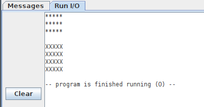

# PARCIAL 3. Programación


## Programa 2

La función linea(car) imprime en la consola una línea de 5 caracteres. Tiene un parámetro de entrada, car, que indica el carácter a usar para dibujar la línea. No tienen ningún parámetro de salida

La implementación de esta función se encuentra en el fichero 02_linea.s, cuyo contenido es:

```asm
#----------------------------------------
#-- Funcion linea(car)
#--
#-- Dibujar una linea de 5 caracteres
#-- ENTRADAS:
#--   a0: caracter a usar para dibujar la linea
#--
#-- SALIDAS: Ninguna
#----------------------------------------

	.globl linea
	
	#-- Servicios del sistema operativo
	.eqv PRINT_CHAR   11
	
	
	#-- Numero de caracteres en la linea
	.eqv N 5
	
	.text
	
	#-- Punto de entrada de la funcion
linea:

	#-- Contador de caracteres en la linea
	li t0, 0
	
	#-- Comprobar si la linea se ha completado
bucle:
	li t1, N
	beq t0,t1,fin
	
	#-- Imprimir el caracter
	li a7, PRINT_CHAR
	ecall
	
	#-- Incrementar el contador de caracteres
	addi t0,t0,1
	
	b bucle
	
fin:
	#-- Imprimir un salto de linea
	li a0, '\n'
	li a7, PRINT_CHAR
	ecall
	
	#-- Retornar
	ret
```

La función bloque(car, lineas) imprime varias líneas de caracteres, una debajo de la otra. Tiene dos parámetros de entrada: el carácter a usar para dibujar las líneas, y el número de líneas a dibujar. No devuelve ningún valor. La función bloque() llama a la función linea() para dibujar cada una de las líneas

Además se quiere hacer un programa principal cuya salida en consola sea la siguiente:



El programa imprime en la consola dos bloques, llamando a la función bloque(). El primero está formado por 3 líneas con asteriscos, y el segundo por 4 líneas con el carácter 'X'. Ambos bloques están separados por un salto de línea

Se pide:

a) (2.5 ptos) Implementar la función bloque en el fichero 02_bloque.s  
b) (2.5 ptos) Implementar el programa principal en el fichero 02_main.s  

**NOTA**: Este programa está formado únicamente por tres ficheros: 02_linea.s, 02_bloque.s y 02_main.s. Debe funcionar sin añadir ninguno más


