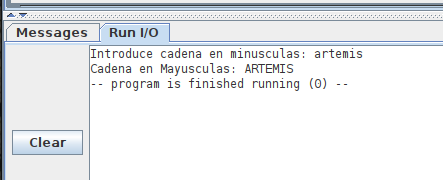

# PARCIAL 2. Programación
# Fecha: 30-Nov-2022

Escribe un programa para el procesador RV32I, en el fichero **mayus.s**. TODAS las constantes necesarias, de cualquier tipo, tienen que estar definidas en el fichero mayus.s (No puede haber otros ficheros)

El programa deberá pedir al usuario que introduzca una cadena en minúsculas. Este texto se pasará a mayúscula, y **se guardará en otra zona** de la memoria

La **primera palabra** del segmento de datos se **DEBE** dejar a **0**, y NO se utilizará (Está reservada para guardar variables futuras). A continuación de ella se **debe** situar la **cadena convertida a mayúsculas**. Y detrás de esta se guarda la **cadena original** en minusculas introducida por el usuario

Para convertir a mayúsculas usamos el **siguiente algoritmo**, que consiste en sumar el valor 32 a todos los carateres de la cadena

1. Inicializar el puntero a la cadena inicial (en minúsculas)
2. Inicializar el puntero a la cadena destino (La que estará en mayúsculas)
3. Leer el caracter actual de la cadena inicial
4. Si este caracter es '\n', terminar
5. Sumar el valor -32 al caracter actual
6. Guardar este nuevo valor en la posición actual de la cadena destino
7. Incrementar el puntero de cadena inicial
8. Incrementar el puntero de la cadena destino
9. Repetir desde el punto 3

En este pantallazo se muestra el funcionamiento



## Bonus: Optimización en tiempo. 
Suponiendo que cada instrucción tarda un ciclo en ejecutarse, obtendrás este bonus si consigues pasar la cadena "artemis" a mayúsculas empleando menos de 73 ciclos

**NOTA**: Envía el fichero mayus.s con la solución como una **entrega del laboratorio**

## Solución


```asm
#-- Programa mayus.s. Convertir una cadena introducidda por el usuario 
#-- de minúsculas a mayúsculas utilizando el siguiente algoritmo:
#--
# 1. Inicializar el puntero a la cadena inicial (en minúsculas)
# 2. Inicializar el puntero a la cadena destino (La que estará en mayúsculas)
# 3. Leer el caracter actual de la cadena inicial
# 4. Si este caracter es '\n', terminar
# 5. Sumar el valor-32 al caracter actual
# 6. Guardar este nuevo valor en la posición actual de la cadena destino
# 7. Incrementar el puntero de cadena inicial
# 8. Incrementar el puntero de la cadena destino
# 9. Repetir desde el punto 3

 	#-- Constantes del Sistema Operativo 
   #-- usadas. Deben estar en este fichero (POR ESPECIFICACIONES)
   .eqv PRINT_STRING 4
   .eqv READ_STRING  8
   .eqv EXIT         10

   #-- Tamaño maximo cadena introducida por el usuario
   .eqv MAX 20
   
   #-- Valor a sumar para convertir a mayusculas
   .eqv TO_MAYUS -32
   		
   .data
   
   #-- ESPECIFICACION: La primera palabra está reservada (e inicializada a 0)
   .word 0
   
   #-- ESPECIFICACION: Cadena destino (en mayúsuclas)
str_mayusc:    .space MAX

   #-- ESPECIFICACION: Cadena original (introducida por el usuario)
   #-- en minusculas
str_minusc:    .space MAX

#-- Resto de mensaje a imprimir
msg1:   .string "Introduce cadena en minusculas: "
msg2:   .string "Cadena en Mayusculas: "
   
   .text
   
   #-- Imprimir mensaje
   la a0, msg1
   li a7, PRINT_STRING
   ecall
   
   #-- Pedir cadena al usuario
   la a0, str_minusc
   li a1, MAX
   li a7, READ_STRING
   ecall
   
   #--Pasar a mayuscula!!
   
   # 1. Inicializar el puntero a la cadena inicial (en minúsculas)
   #--- Se encuentra en a0
   
   # 2. Inicializar el puntero a la cadena destino (La que estará en mayúsculas)
   #-- Usamos a1 como puntero destino
   la a1, str_mayusc
   
   #-- Optimizacion! Ponemos el valor del salto de linea '\n' en el 
   #-- registro t1 para cumplir con el BONUS
   li t1, '\n'
   
bucle:  
   # 3. Leer el caracter actual de la cadena inicial
   #-- t0 ---> Caracter actual (en minusculas)
   lb t0, 0(a0)
   
   # 4. Si este caracter es '\n', terminar
   beq t0,t1, fin
   
   # 5. Sumar el valor para pasar a mayusculas (valor -32, en constante TO_MAYUS)
   addi t2,t0,TO_MAYUS
   
   # 6. Guardar este nuevo valor en la posición actual de la cadena destino
   sb t2, 0(a1)
   
   # 7. Incrementar el puntero de cadena inicial
   addi a0,a0,1
   
   # 8. Incrementar el puntero de la cadena destino
   addi a1,a1,1
   
   # 9. Repetir desde el punto 3
   b bucle
  
  
  
   #------------------
   
fin:	
   #-- Imprimir el segundo mensaje
   la a0, msg2
   li a7, PRINT_STRING
   ecall
   
   #-- Imprimir la cadena en mayusculas
   la a0, str_mayusc
   li a7, PRINT_STRING
   ecall
   
   #-- Terminar
   li a7, EXIT
   ecall
```

Este programa tarda **72 ciclos**, por lo que se cumple el BONUS!. Los ciclos los puedes ver en el registro `cycle` de la pestaña **Control and Status** en la parte de la derecha de Rars, al lado de los registros
