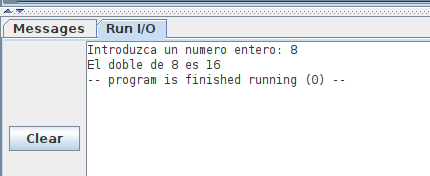

# PARCIAL 3. Programación

Escribe un programa en ensamblador para un Riscv **RV32I**:

**a)** (2 ptos) Implementar la función **doble(n)**, que toma el valor entero **n** y devuelve el doble. Esta función tiene un parámetro de entrada (n) y un valor de retorno (el valor doble). Por ejemplo, la llamada a la función doble(8) nos devolverá el valor 16. Recuerda que el RV32I **NO** tiene la instrucción de multiplicación (por lo que no la puedes usar). Esta función debe estar implementada en el fichero **doble.s**

**b)** (3 ptos)  Implementa un programa principal en el fichero **main.s**. Este programa deberá pedir un número entero al usuario y mostrará en pantalla su valor doble, **siguiendo el formado** indicado en este pantallazo de ejemplo

**NOTA**: Todas las constantes necesarias para los servicios del sistema operativo deberán estar en el fichero **so.s**

**NOTA**: Ficheros a entregar:
* so.s
* doble.s
* main.s

