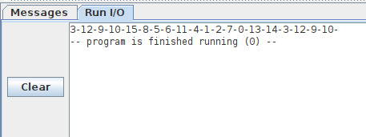
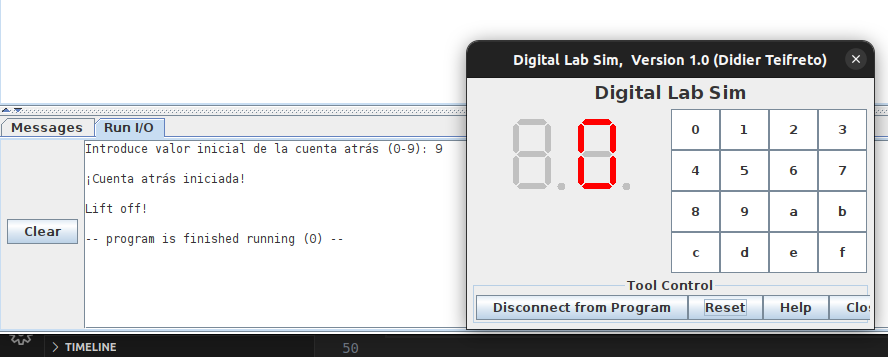

# PARCIAL 3. Parte Práctica. Lunes, 8-Mayo-2023

* Asignatura: Arquitectura de computadores
* Grado: Ingeniería en Robótica Softwsare. Escuela de Ingeniería de Fuenlabrada (EIF), URJC

* Tiempo: 1 hora

* Ficheros a entregar:
  * Del ejercicio 1:
    - **random.s**
    - **1_main.s**
  * Del ejercicio 2:
    - **countdown.s**

* Tus programas deben funcionar con sólo esos 3 archivos. No deben depender de ninguno otro (Por tanto, las constantes del sistema operativo las debes definir dentro de ellos)

# Ejercicio 1 (6 ptos)

La generación de números aleatorios ha sido uno de los grandes problemas de la computación.
Una solución es utilizar sucesiones de números pseudoaleatorios generados a partir de esta expresión:

Xn+1 = (a*Xn + b) mod c

Donde a,b y c son constantes. Xn es un número pseudoaleatorio a partir del cual se calcula el siguiente (xn+1).
El valor inicial Xo se denomina **semilla**

Las operaciones necesarias son la multiplicación, adición y **resto** (operación módulo).
Todas ellas están disponibles en los procesadores RV32IM. Las instrucciones correspondientes son mul, add y **rem**

Queremos escribir la función **random(Xn)** que implementa esta expresión. Tiene un único parámetro de entrada, Xn, que es el número pseudoaleatorio 
actual, y calcula el siguiente usando los coeficientes a=37, b=1373 y c=16

Para probar esta función se utiliza un **programa principal** que imprime en la consola los **20 primeros números pseudoaleatorios** 
separados por el carácter '-'. Se utiliza como **semilla** el valor Xo = 3

La salida en la consola debe ser la siguiente:

El código se escribirá en lenguaje ensamblador del procesador RV32IM

Se pide:

**a)** (3 ptos) Implementar la **función** *random(Xn)* en el fichero `random.s`. Los coeficientes deben estar definidos 
como las constantes CA, CB y CC en el código. Utilizar la instrucción `rem` (ver manual) para calcular la operación de módulo

**b)** (3 ptos) Implementar el **programa principal** en el fichero `1_main.s`. Todas las constantes necesarias para acceder 
a los servicios del sistema operativo deben estar definidas dentro de este fichero

# Ejercicio 2 (4 ptos)

Nos han contratado como ingenieros software para trabajar en el proyecto Artemis II, que enviará una tripulación a la orbita lunar en 2024. El centro de control de lanzamiento está actualizando sus consolas para usar procesadores RISC-V. Nuestro equipo de ingeniería es el encargado de construir y programar estas nuevas consolas

Nuestro jefe de proyecto nos ha dado la tarea de implementar la función **countdown(ini)** que muestra una cuenta atrás en un display de 7 segmentos comenzando por el digito ini (0-9). Sólo tiene un parámetro de entrada, y no devuelve ningún valor. Así, si llamamos a la función countdown(3), en el display de 7 segmentos se verán los números 3, 2, 1 y 0. Cada vez que se muestra un dígito, hay que realizar una espera de 500 ms llamando al servicio **sleep** del sistema operativo

Para mostrar números en el display, otro ingeniero nos ha proporcionado la función **digit(n)**, que muestra el número *n* en el display (n debe estar en el rango 0-9). Así, digit(7) muestra el número 7 en el display. Esta función se encuentra en el fichero **digit.s**

Otro ingeniero nos ha proporcionado un programa de pruebas, en el fichero **2_main.s**. Este programa pide al usuario el numero de comienzo de la cuenta atrás (0-9), llama a la función countdown() con este número, para iniciar la cuenta atrás en el display, muestra mensajes en la consola y termina.  En estas imágenes se muestra el resultado una vez finalizada una cuenta atrás de 9:

(Ver animación prog2-anim.gif)

Se pide:

* (4 ptos) Implementa la función countdown(ini) en el fichero `countdown.s`. Todas las constantes que uses deben estar definidas en el mismo fichero. Usa los ficheros `digit.s` y `2_main.s` para probar tu función, pero NO puedes modificarlos

