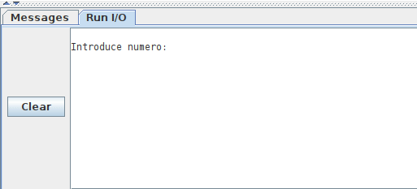
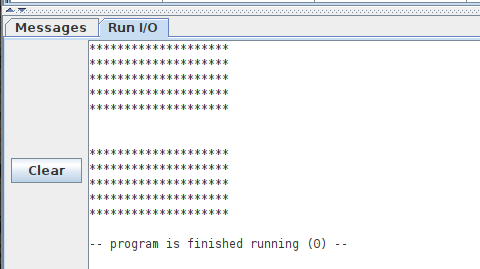

# Laboratorio. Convocatoria Extraordinaria. Lunes, 17-Junio-2024
* Puntuacion: 10 ptos

# CONVOCATORIA EXTRAORDINARIA. Parte Práctica (TODO)

* Asignatura: Arquitectura de computadores
* Grado: Ingeniería de Sistemas Audiovisuales y Multimedia. Escuela de Ingeniería de Fuenlabrada (EIF), URJC

* Tiempo: 1h y media hora

* Ficheros a entregar:
  * Del ejercicio 1:
    - **trunc255.s**
    - **1_main.s**
  * Del ejercicio 2:
    - **rect.s**

# Ejercicio 1 (6 ptos)

Implementar la función **trunc255(n)** en ensamblador de un RV32I. Esta función trunca un número entero positivo. Si el número n es menor a 255, devuelve el propio número n, pero si es mayor o igual a 255, entonces devuelve 255. Matemáticamente la definimos así:

* trunc255(n):
  * Devuelve n si n < 255
  * Devuelve 255 en caso contrario

Así, por ejemplo, trunc255(34) = 34 y trunc255(300) = 255

Esta función tiene un argumento de entrada: el número entero (n) y uno de salida: su valor truncado.

Para probar la función utilizamos un programa principal que pide al usuario un número entero, llama a trunc255() con este número para obtener su valor truncado, lo imprime en la consola y repite el proceso. Cuando el usuario introduce el número 0 el programa principal termina

En esta animación se muestra un ejemplo de funcionamiento del programa principal. El usuario calcula los valores truncados de 34 y 300. Por último introduce 0 para terminar

Se pide:

**a)** (3 ptos) Implementar la **función** *trunc255(n)* en el fichero `trunc255.s`

**b)** (3 ptos) Implementar el **programa principal** en el fichero `1_main.s`. Todas las constantes necesarias para acceder a los servicios del sistema operativo deben estar definidas dentro de este fichero

# Ejercicio 2 (4 ptos)

Nuestro jefe de proyecto nos ha proporcionado dos funciones y un programa principal, situados en ficheros separados:

* Función linea(n): Dibujar una linea de n asteriscos. Situado en el fichero `linea.s`
* Función rect(): Dibujar un rectángulo de 5 líneas de altura. Situado en el fichero `rect.s`
* Programa principal: Dibuja dos rectángulos, uno encima de otro. Situado en el fichero `2_main.s`

Tanto el programa principal como la función linea() funcionan correctamente. Sin embargo, la función rect() necesita que la modifiquemos para que funcione correctamente

La salida del programa principal, con la función rect() correcta, es la mostrada en esta figura:

Se pide:

* (4 ptos) Modifica la función rect() para que el programa principal funcione correctamente. Sólo puedes añadir código en las zonas indicadas en los comentarios. No puedes modificar el CÓDIGO ORIGINAL

